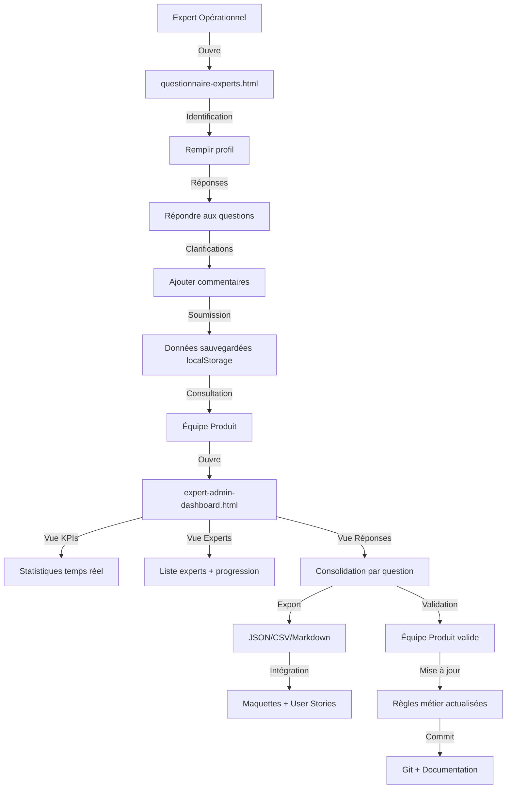

# 🏖️ Questionnaire Experts Odyssey - Calendrier des Chambres

**Version :** 2.0 (Dark Mode + Responsive)  
**Date :** 19 juin 2026  
**Équipe :** Produit Odyssey

---

## 🎯 Objectif

Outil collaboratif pour collecter les retours des experts opérationnels Club Med sur les 11 règles de gestion du **Calendrier des Chambres** dans Odyssey PMS.

## ✨ Nouveautés v2.0

- 🌓 **Dark Mode** : Détection automatique + compatible tous OS
- 📱 **Responsive** : Mobile, tablette, desktop optimisé
- 🎨 **CSS moderne** : Variables CSS, clamp(), media queries
- 🌍 **Bilingual** : Français / Anglais avec switcher
- 🚀 **GitHub Pages** : Hébergement gratuit et collaboration en ligne

---

## 📁 Structure du dossier

```
outil-collaboratif-experts/
├── index.html                                    # Page d'accueil (redirection)
├── odyssey-questionnaire-experts-STANDALONE.html # Questionnaire experts
├── odyssey-expert-admin-dashboard.html           # Dashboard admin
├── questions-business-only.json                  # 11 questions métiers
├── club-med-trident-design-tokens.css            # Design system Club Med
├── responsive-dark-mode.css                      # Styles responsive + dark mode
├── build-standalone.py                           # Script de génération
└── README.md                                     # Documentation
```

---

## 🚀 Démarrage rapide

### Option 1 : GitHub Pages (recommandé)

**Lien direct** : `https://tiphaine-mtch.github.io/odyssey_questionnaire/`

Partagez simplement ce lien avec vos experts !

### Option 2 : En local

1. Télécharger le dossier complet
2. Double-cliquer sur `odyssey-questionnaire-experts-STANDALONE.html`
3. Remplir le questionnaire (sauvegarde automatique dans le navigateur)

### Dashboard Admin

Ouvrir `odyssey-expert-admin-dashboard.html` pour :
- ✅ Voir tous les experts et leurs réponses
- 📊 Comparer les réponses par question
- 🗑️ Supprimer des soumissions
- 📤 Exporter en JSON, CSV, Markdown ou rapport de synthèse

---

## 📊 Fonctionnalités

### Interface Expert (`odyssey-questionnaire-experts.html`)

#### ✅ Identification
- Nom complet
- Email professionnel
- Rôle (Chef de Réception, Revenue Manager, etc.)
- Localisation (Resort / Business Unit / Siège)
- Nom du resort ou BU selon localisation

#### ✅ Questions structurées
- **Catégories** : Programme Fidélité, Check-in/out, Capacités, etc.
- **Types de réponses** :
  - Choix multiples (radio buttons)
  - Sélection unique (dropdown)
  - Champs numériques (prix, durées)
  - Texte libre
- **Zone commentaires** : Pour chaque question, possibilité d'ajouter des clarifications

#### ✅ Sauvegarde automatique
- LocalStorage pour persistance des données
- Récupération automatique en cas de fermeture accidentelle
- Barre de progression en temps réel

#### ✅ Export individuel
- JSON : Structure complète pour intégration technique
- CSV : Pour analyse dans Excel/Google Sheets

---

### Dashboard Admin (`odyssey-expert-admin-dashboard.html`)

#### 📊 KPIs temps réel
- **Experts actifs** : Nombre total d'experts ayant répondu
- **Réponses collectées** : Nombre total de réponses
- **Taux de complétion** : Pourcentage global de progression
- **Questions clarifiées** : Nombre de commentaires/questions posées

#### 👥 Onglet Experts
- Liste de tous les experts ayant soumis des réponses
- Avatar avec initiales
- Informations : email, rôle, localisation, resort/BU
- Barre de progression individuelle
- Filtres :
  - Recherche par nom
  - Localisation (Resort / BU / Siège)
  - Statut complétion (>80% / 20-80% / <20%)

#### 📊 Onglet Réponses
- Vue consolidée par question
- Toutes les réponses d'experts regroupées
- Identification de l'expert pour chaque réponse
- Commentaires/clarifications visibles
- Filtres :
  - Catégorie (Business / Design / Tech)
  - Statut (Répondues / Non répondues)

#### 📥 Onglet Export & Validation
- **Export multi-format** :
  - **JSON** : `odyssey-experts-data-YYYY-MM-DD.json`
    - Structure complète pour intégration technique
    - Import direct dans maquettes React/Vue
  
  - **CSV** : `odyssey-experts-data-YYYY-MM-DD.csv`
    - Analyse dans Excel/Google Sheets
    - Pivot tables, graphiques
  
  - **Markdown** : `odyssey-experts-data-YYYY-MM-DD.md`
    - Format lisible pour mise à jour docs
    - Intégration dans user stories
  
  - **Rapport Synthèse** : `odyssey-experts-summary-YYYY-MM-DD.md`
    - Vue consolidée par question
    - Consensus et divergences identifiés

- **Validation & Mise à jour** :
  - Bouton "Valider et mettre à jour les règles métier"
  - Déclenche la mise à jour automatique des documents :
    - `club-med-loyalty-program.md`
    - `odyssey-calendar-specifications.html`
    - `regles-metier-capacites.md`

---

## 🔄 Workflow complet



---

## 🎨 Design System

Les deux interfaces utilisent le **Club Med Trident Design System** :

### Couleurs
- Brand Black Coal : `#000000`
- Saffran Yellow : `rgb(253, 190, 0)`
- Ultramarine Blue : `rgb(0, 32, 91)`
- Light Sand : `rgb(242, 237, 227)`
- Loyalty colors (Turquoise, Silver, Gold, Platinum)

### Typographie
- Titres : `Newsreader` (serif)
- Corps : `Inter` (sans-serif)

### Spacing
- XXS à XXL : 4px → 64px

### Composants
- Cards avec `box-shadow`
- Badges arrondis
- Boutons avec hover effects
- Progress bars

---

## 💾 Structure des données

### Format JSON export

```json
{
  "id": "ODYSSEY-1718703600000",
  "expert": {
    "name": "Marie Dupont",
    "email": "marie.dupont@clubmed.com",
    "role": "chef_reception",
    "location": "resort",
    "resort": "Les Arcs Panorama (ARPC)",
    "businessUnit": null,
    "startDate": "2026-06-18T10:30:00Z"
  },
  "answers": {
    "q1_1_1": "n_plus_1",
    "q1_1_2": "j_3",
    "q1_1_3": "auto_n2",
    "q1_1_comment": "Dans notre resort, le surclassement N+2 pour Platinum se fait automatiquement si N+1 occupée.",
    "q1_2_1": "30",
    "q1_2_2_gold": "50",
    "q1_2_2_silver": "50",
    "q1_2_2_turquoise": "50"
  },
  "submittedAt": "2026-06-18T11:45:00Z"
}
```

### Format CSV export

```csv
Expert,Email,Rôle,Localisation,Question,Réponse,Commentaire
Marie Dupont,marie.dupont@clubmed.com,chef_reception,resort,q1_1_1,n_plus_1,"Dans notre resort..."
Marie Dupont,marie.dupont@clubmed.com,chef_reception,resort,q1_2_1,30,""
```

---

## 🔧 Configuration technique

### Prérequis

**Frontend uniquement** (HTML + CSS + JS vanilla)
- Aucune dépendance npm
- Aucun serveur backend requis (localStorage)
- Compatible tous navigateurs modernes

### Installation

1. **Copier le design system** :
```bash
cp "../club-med-trident-design-tokens.css" "./club-med-trident-design-tokens.css"
```

2. **Ouvrir les fichiers HTML** :
   - Double-clic sur les fichiers
   - Ou via serveur local : `python3 -m http.server 8000`

### Déploiement production

Pour un déploiement production, remplacer localStorage par une API backend :

#### Backend API endpoints recommandés

```javascript
// POST /api/experts/submissions
{
  "expert": { ... },
  "answers": { ... }
}

// GET /api/experts/submissions
[
  { "id": "...", "expert": { ... }, "answers": { ... } }
]

// GET /api/experts/statistics
{
  "totalExperts": 15,
  "totalAnswers": 320,
  "completionRate": 67,
  "clarificationCount": 42
}

// POST /api/experts/validate
{
  "submissionIds": ["ODYSSEY-123", "ODYSSEY-456"],
  "validatedBy": "product.team@clubmed.com"
}
// Returns: { "updated": ["loyalty.md", "specs.html"] }
```

#### Stack technique recommandé

**Option 1 : Node.js + Express + PostgreSQL**
```javascript
// server.js
const express = require('express');
const { Pool } = require('pg');

const pool = new Pool({
  connectionString: process.env.DATABASE_URL
});

app.post('/api/experts/submissions', async (req, res) => {
  const { expert, answers } = req.body;
  const result = await pool.query(
    'INSERT INTO expert_submissions (expert, answers) VALUES ($1, $2) RETURNING id',
    [expert, answers]
  );
  res.json({ id: result.rows[0].id });
});
```

**Option 2 : Python + FastAPI + SQLAlchemy**
```python
# main.py
from fastapi import FastAPI
from sqlalchemy.orm import Session

app = FastAPI()

@app.post("/api/experts/submissions")
async def create_submission(submission: ExpertSubmission, db: Session):
    db_submission = DBSubmission(**submission.dict())
    db.add(db_submission)
    db.commit()
    return {"id": db_submission.id}
```

---

## 📋 Questions couvertes

Le questionnaire couvre **48 questions** réparties en 3 catégories :

### 🏢 Business (21 questions)
- Programme fidélité (surclassement, late checkout, early check-in)
- Règles de cancellation
- Overbooking
- Housekeeping
- Gestion des groupes
- Notifications

### 🎨 Design (14 questions)
- Composants PMS manquants dans Figma
- Échelle typographique complète
- Bibliothèque d'icônes
- Ombres et élévations
- Animations/transitions
- Mode sombre
- Breakpoints responsive
- Accessibilité WCAG

### 💻 Tech (13 questions)
- Stack backend/frontend
- Architecture temps réel (WebSocket)
- Intégrations (CRS, Channel Manager, Stripe, Housekeeping, SendGrid)
- Authentification/sécurité
- Infrastructure cloud
- Stratégie de tests

---

## ✅ Checklist déploiement

### Phase 1 : Setup (1 jour)
- [ ] Créer dossier `outil-collaboratif-experts/`
- [ ] Copier fichiers HTML
- [ ] Copier `club-med-trident-design-tokens.css`
- [ ] Tester les deux interfaces localement

### Phase 2 : Communication (2 jours)
- [ ] Identifier les experts clés (15-20 personnes)
  - [ ] 5-8 experts resorts (chefs réception, gouvernantes)
  - [ ] 3-5 experts BU (revenue managers, ops managers)
  - [ ] 2-3 experts siège (responsable fidélité, produit)
- [ ] Envoyer email d'invitation avec :
  - [ ] Lien vers questionnaire
  - [ ] Guide d'utilisation
  - [ ] Deadline de réponse (ex: J+14)
- [ ] Créer canal Slack `#odyssey-experts-questions` pour support

### Phase 3 : Collecte (2 semaines)
- [ ] Monitoring quotidien du taux de réponse (dashboard admin)
- [ ] Relances à J+7 pour experts n'ayant pas commencé
- [ ] Réponses aux clarifications posées par experts
- [ ] Support technique si problèmes d'accès

### Phase 4 : Consolidation (3 jours)
- [ ] Export de toutes les réponses (JSON + Markdown)
- [ ] Analyse des consensus et divergences
- [ ] Identification des questions nécessitant arbitrage produit
- [ ] Réunion équipe produit pour validation finale

### Phase 5 : Mise à jour docs (2 jours)
- [ ] Intégration des réponses validées dans :
  - [ ] `club-med-loyalty-program.md`
  - [ ] `odyssey-calendar-specifications.html`
  - [ ] `regles-metier-capacites.md`
- [ ] Création user stories avec détails experts
- [ ] Mise à jour maquettes Figma avec règles validées
- [ ] Commit + PR pour review équipe

### Phase 6 : Remerciements (1 jour)
- [ ] Email de remerciement à tous les experts
- [ ] Partage du résumé consolidé
- [ ] Invitation à la démo du PMS (quand prêt)

---

## 📞 Support

### Questions techniques
- **Slack** : `#odyssey-pms-dev`
- **Email** : dev-odyssey@clubmed.com

### Questions produit
- **Slack** : `#odyssey-product`
- **Email** : product-odyssey@clubmed.com

### Questions experts
- **Slack** : `#odyssey-experts-questions` (à créer)
- **Email** : experts-odyssey@clubmed.com

---

## 📜 Licence

© 2026 Club Med - Équipe Produit Odyssey  
Usage interne uniquement

---

**Créé par :** Équipe Produit Odyssey  
**Dernière mise à jour :** 18 juin 2026
